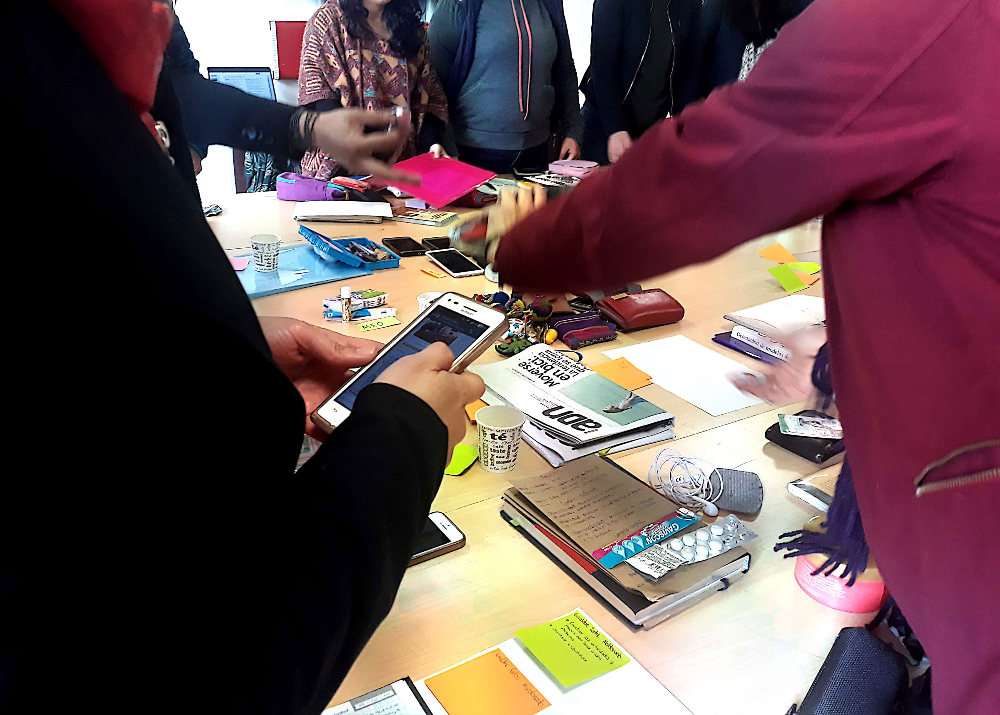

How do museums take advantage of information technologies and virtual environments? Well, based on this question, a pedagogical experience was created for the fifth, sixth and seventh cohorts of the Master's Degree in Museology and Heritage Management at the National University of Colombia, the name of the course is, ... to no one's surprise 😌, INFORMATION TECHNOLOGIES AND VIRTUAL ENVIRONMENTS.

This course was shared with other teachers, in the first cohorts it was taught together with Philippe Boland and Ana María Moreno Ballesteros. The course of the year 2021 I worked together with [Paola Parra](https://www.linkedin.com/in/paoltricia).

[Click here to see the course program (in spanish)](./program-mmgp-jcarroyos-paoltricia.pdf)

## Class pics

