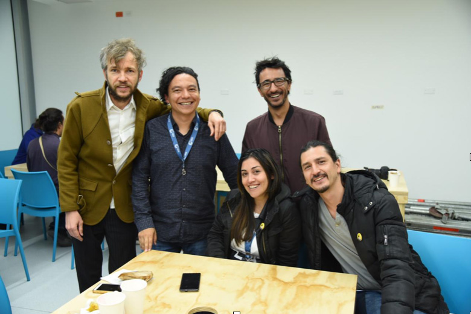
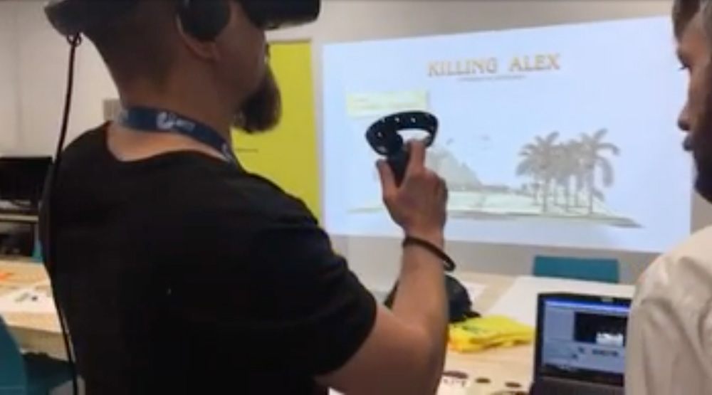
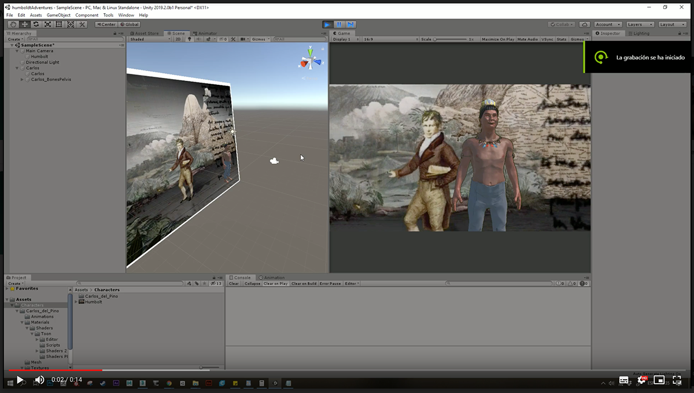
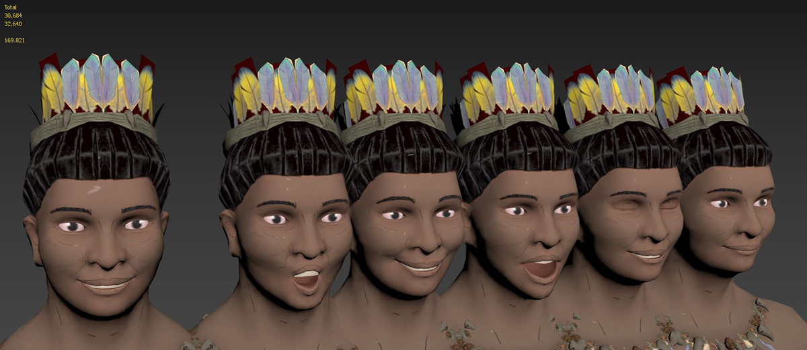
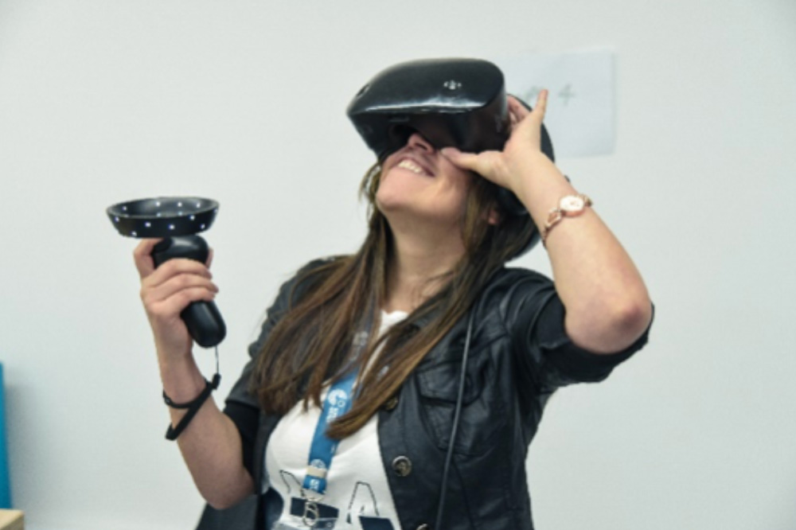

# Humboldt and the Americas

📆 Jun 2019

Participants in the mixed reality Hackathon "Humboldt and the Americas", our team
“La Piragua” created a proposal based on the correspondence between Francisco José de Caldas and Alexander von Humboldt. An immersive game prototype thinked like a multiverse travel experience, through places and moments of Humboldt's journey in the Americas, in which "Alex" will travel through different interactive scenarios with characters that would take you into experiences from contemplation to measurement.

## Team

Camilo Jimenez, Juan Camilo Fonnegra, Juan Carlos Arroyo Sosa, Gladys Viviana Gomez Rojas, Thomas Wagner. Modeling and rigging: Juan Camilo Salamanca.

[Press release](https://www.goethe.de/prj/hya/es/inh/hackaton2.html "En Colombia, la Hackatón de realidad mixta “Humboldt y las Américas” ya tiene ganador") | [Selection document](https://www.goethe.de/prj/hya/es/inh/hacka.html "Estos son los seleccionados de México, Colombia y Perú para participar en la Hackatón de realidad mixta")

## Screenshots

## Development framework

We develop the prototype using Unity and [Microsoft Mixed Reality Toolkit](https://github.com/microsoft/MixedRealityToolkit-Unity). We tested the VR environment with the Samsung Gear VR glasses.

## Documents

- [Killing Alex Game Concept Document](./assets/Killing%20Alex%20Game%20Concept%20Document.pdf)
- [Killing Alex Game Design Document](./assets/Killing%20Alex%20Game%20Design%20Document.pdf)

## Code

Explore the source code in github repo [Humboldt learns to hurt himself](https://github.com/jcarroyos/MPV_Humboldt-learns-to-hurt-himself)
