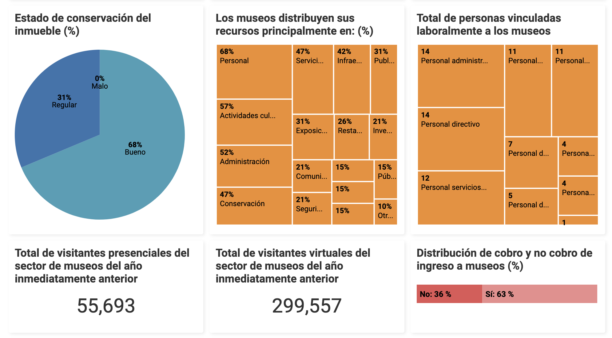

# SIMCO

📆 2019

## The order

Redesign and implement the frontend environment of the Colombian Museum Information System –SIMCO–, improving the user experience and visual design within the framework of activities that allow the dissemination of cultural heritage by the year 2020.

## The challenge

To make the diagnosis of the site www.museoscolombianos.gov.co where the validity of the published information, navigation, visualization on mobile devices, visual design, audiovisual and text content is contemplated. Prepare a redesign that has as scope: graphic proposal, usability, AA and AAA accessibility, typography and color, visual, audiovisual and text content for PC screens and mobile devices. Develop the master page of the website, home pages of each site, internal pages and subsites. Creation of lists and libraries of content and pages of content queries.

## The solution

## The code

### Dataviz module

This module returns the report service from SIMCO to graphs with the aggregated data. Code commissioned to [@laurajunco](https://github.com/laurajunco). View the D3.js code in [https://github.com/jcarroyos/simco-dataviz](https://github.com/jcarroyos/simco-dataviz)
