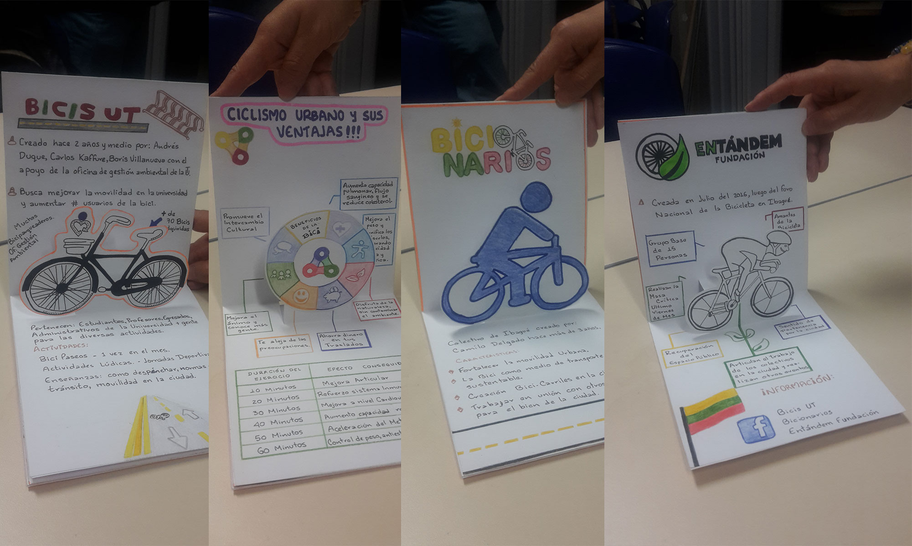
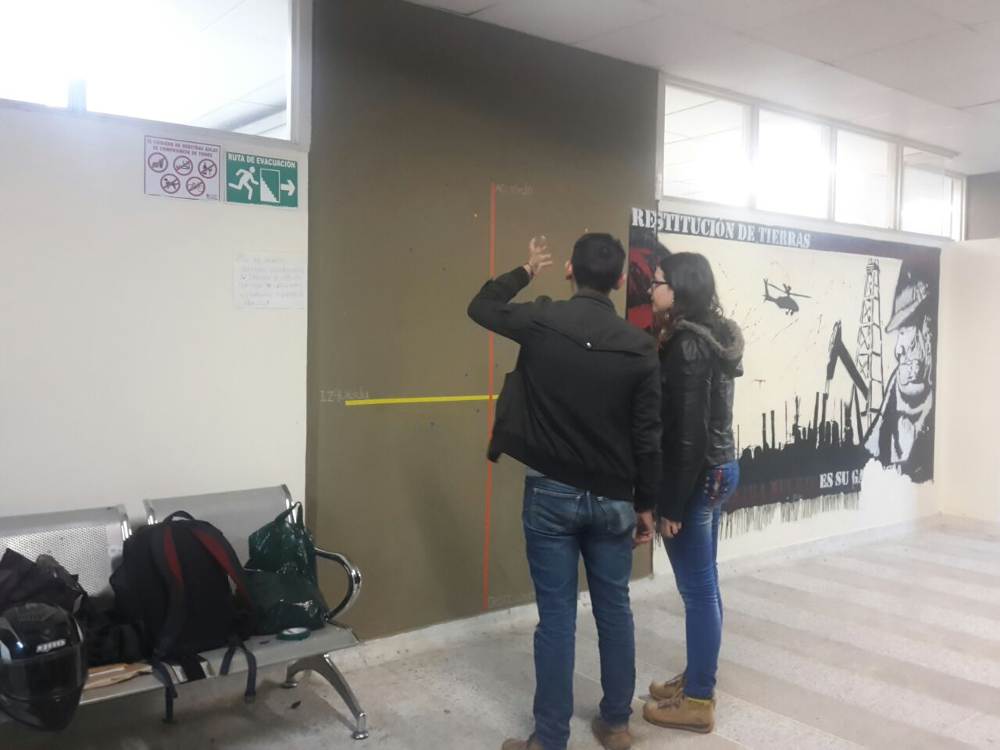
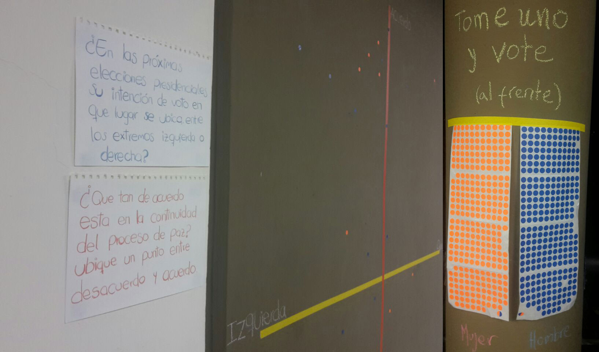
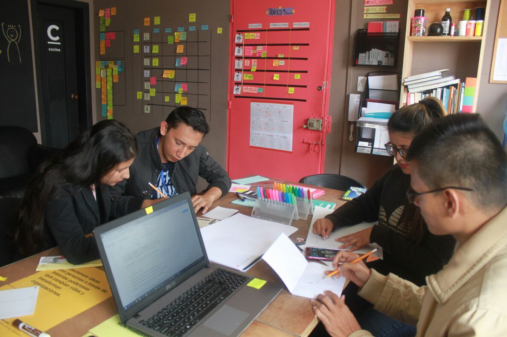
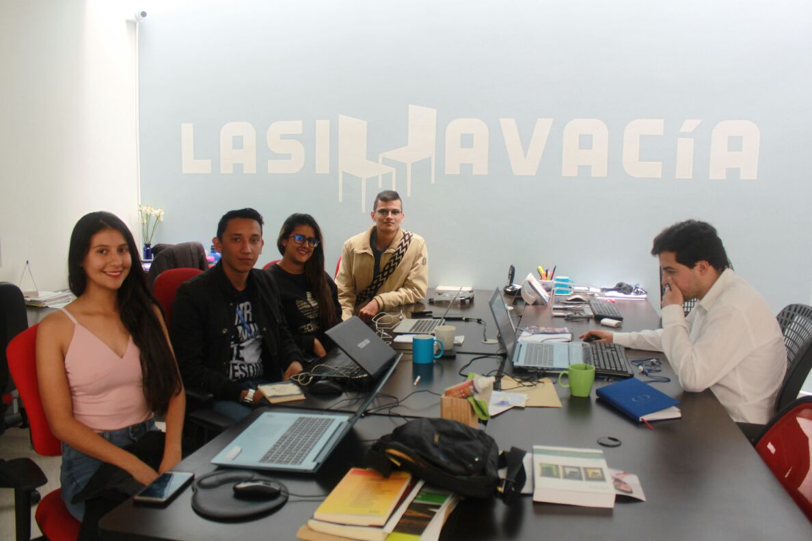

Del 2016 al 2021 tuve la hermosa experiencia de ser profesor de **Infografía** en la [Universidad del Tolima](https://ut.edu.co/). Aprendí y compartí mucho durante durante esos años de enseñanza.

Con un enfoque práctico, este curso presenta la evolución de la infografía, el taller se centra en las preguntas clave:

- ¿Qué es la infografía?
- ¿Para qué sirven las infografías?
- y ¿cómo podemos hacer infografías?

Partiendo de la idea que la infografía en el campo de la comunicación puede entenderse como un género periodístico, durante el curso exploramos las posibilidades de creación y reflexionamos sobre el campo teórico de la investigación de la imagen y los estudios visuales.

## Registros de clase

:::note Proyecto de infografía análoga

:::

:::note Recoleccion de datos en espacio público

:::

:::note Recoleccion de datos en espacio público

:::

:::note Visita de campo en https://tell.com.co/

:::

:::note Visita de campo en https://www.lasillavacia.com/

:::
