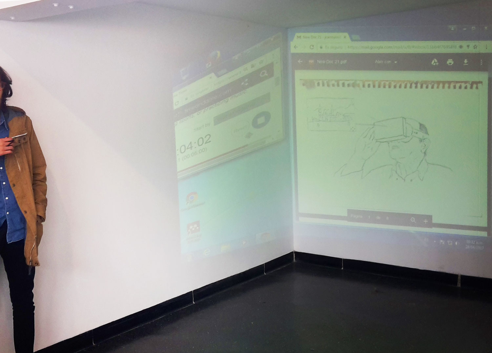
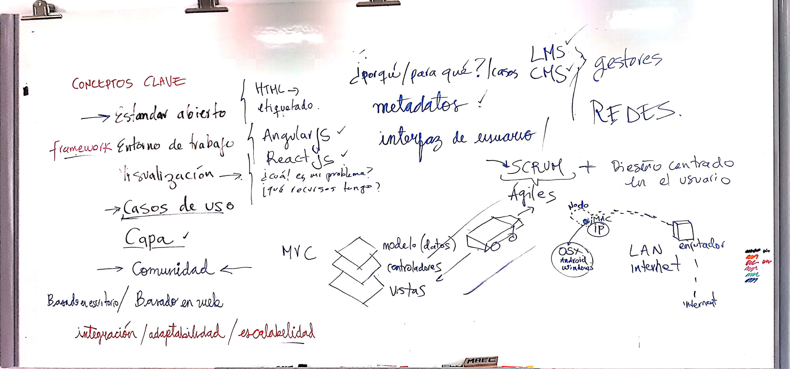
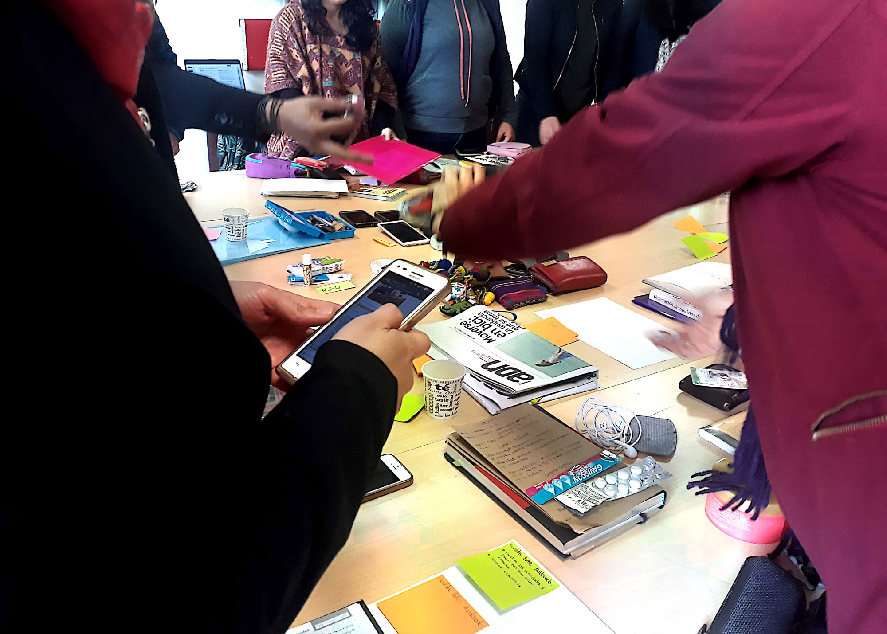
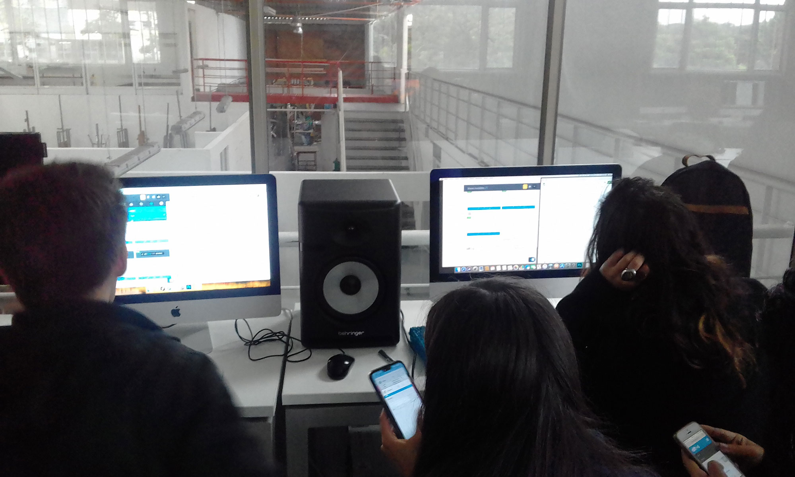

¿Cómo aprovechan los museos las tecnologías de la información y los entornos virtuales? Pues bien, a partir de esta pregunta se generó una experiencia pedagógica para las cohortes quinta, sexta y séptima de la [Maestría en Museología y Gestión del Patrimonio de la Universidad Nacional de Colombia](http://artes.bogota.unal.edu.co/programas-academicos/posgrado/maestria/museologia), el nombre del curso es, ... para sorpresa de nadie 😌, TECNOLOGÍAS DE LA INFORMACIÓN Y ENTORNOS VIRTUALES.

Este curso fue compartido con otros docentes, en las primeras cohortes se impartió junto a Philippe Boland y Ana María Moreno Ballesteros. El transcurso del año 2021 trabajé junto con [Paola Parra](https://www.linkedin.com/in/paoltricia).

[Clic acá para ver el programa del curso](./program-mmgp-jcarroyos-paoltricia.pdf)

## Registros de clase

:::note Procesos de ideación

:::

:::note Apuntes en el tablero

:::

:::note Taller de estructuración de información

:::

:::note Escritura de código

:::
