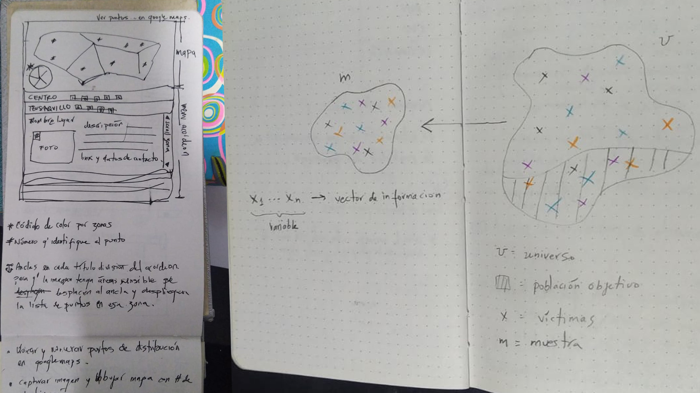

# 1. Introducción al portafolio

Soy artista y programador, visualizador de datos y mediador entre equipos de tecnología e investigación. Mi rol siempre ha sido señalar el valor de las tecnologías de internet y el pensamiento visual para la conceptualización, diseño y definición de productos digitales en el ámbito cultural y memorial.

Bienvenido a mi portafolio, explora por categorías de la barra de navegación izquierda o haz clic en el botón siguiente a continuación.
