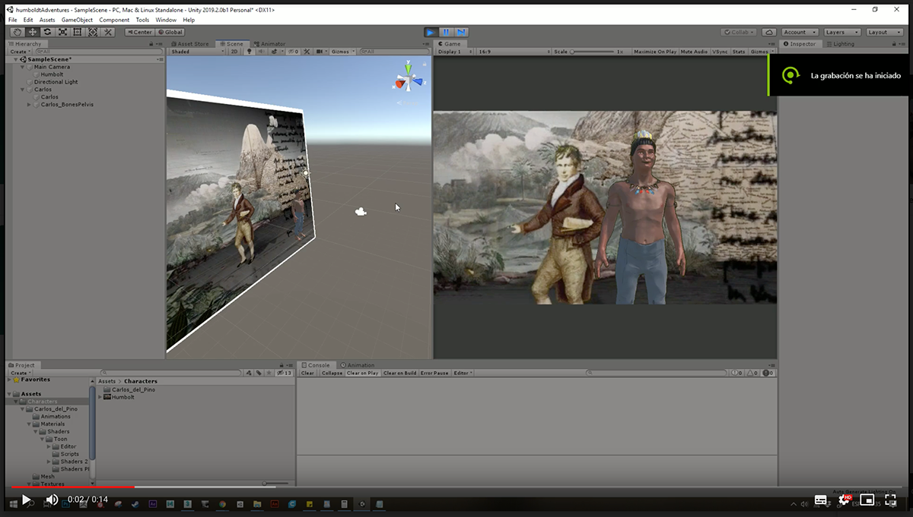

# Humboldt and the Americas


Participants in the mixed reality Hackathon "Humboldt and the Americas", our team
“Killing Alex” created a proposal based on the correspondence between Francisco José de Caldas and Alexander von Humboldt. An immersive game prototype thinked like a multiverse travel experience, through places and moments of Humboldt's journey in the Americas, in which "Alex" will travel through different interactive scenarios with characters that would take you into experiences from contemplation to measurement.

## Team

Camilo Jimenez, Juan Camilo Fonnegra, Juan Carlos Arroyo Sosa, Gladys Viviana Gomez Rojas, Thomas Wagner. Modeling and rigging: Juan Camilo Salamanca.


[Press release](https://www.goethe.de/prj/hya/es/inh/hackaton2.html "En Colombia, la Hackatón de realidad mixta “Humboldt y las Américas” ya tiene ganador") | [Selection document](https://www.goethe.de/prj/hya/es/inh/hacka.html "Estos son los seleccionados de México, Colombia y Perú para participar en la Hackatón de realidad mixta")

## Screenshots





## Create your first React Page

Create a file at `src/pages/my-react-page.js`:

```jsx title="src/pages/my-react-page.js"
import React from "react";
import Layout from "@theme/Layout";

export default function MyReactPage() {
  return (
    <Layout>
      <h1>My React page</h1>
      <p>This is a React page</p>
    </Layout>
  );
}
```

A new page is now available at [http://localhost:3000/my-react-page](http://localhost:3000/my-react-page).

## Create your first Markdown Page

Create a file at `src/pages/my-markdown-page.md`:

```mdx title="src/pages/my-markdown-page.md"
# My Markdown page

This is a Markdown page
```

A new page is now available at [http://localhost:3000/my-markdown-page](http://localhost:3000/my-markdown-page).
