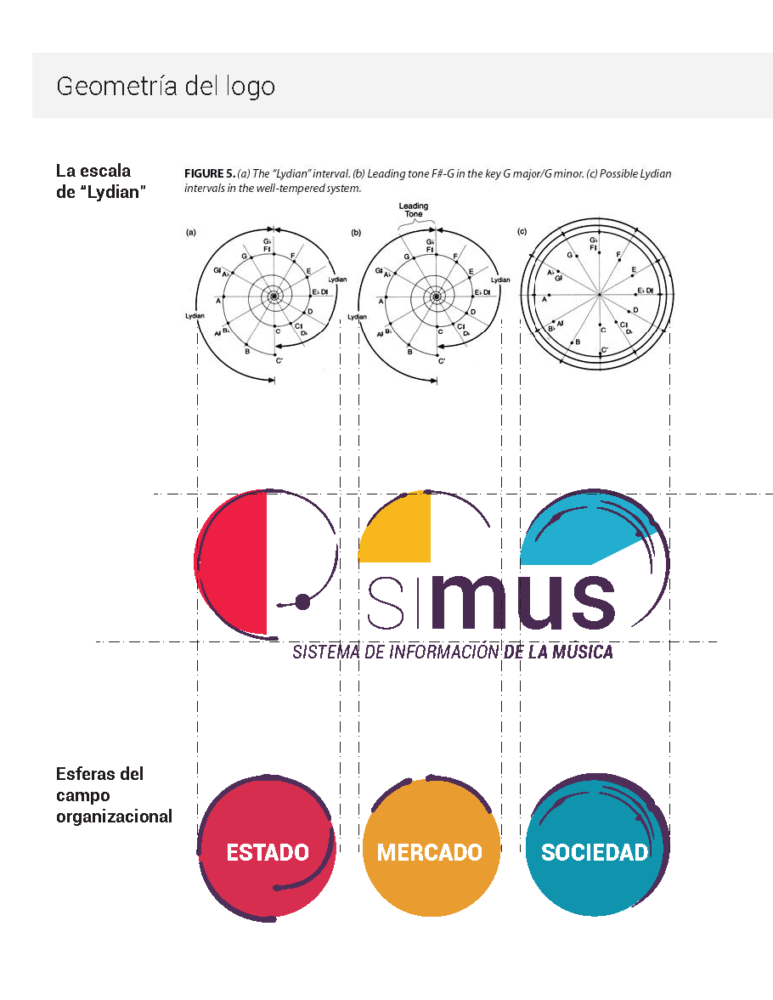
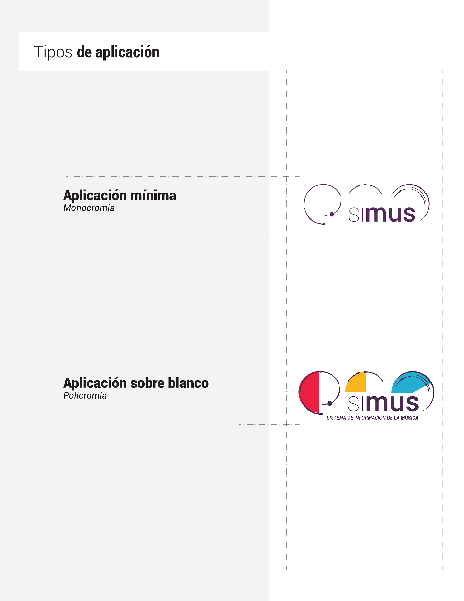
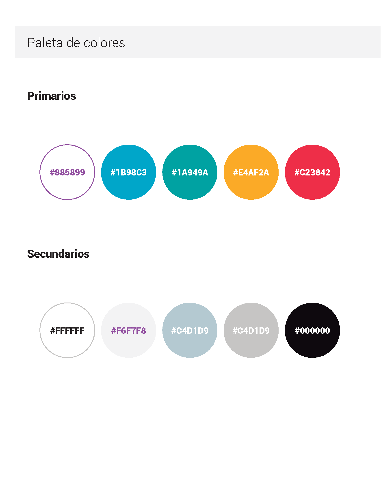
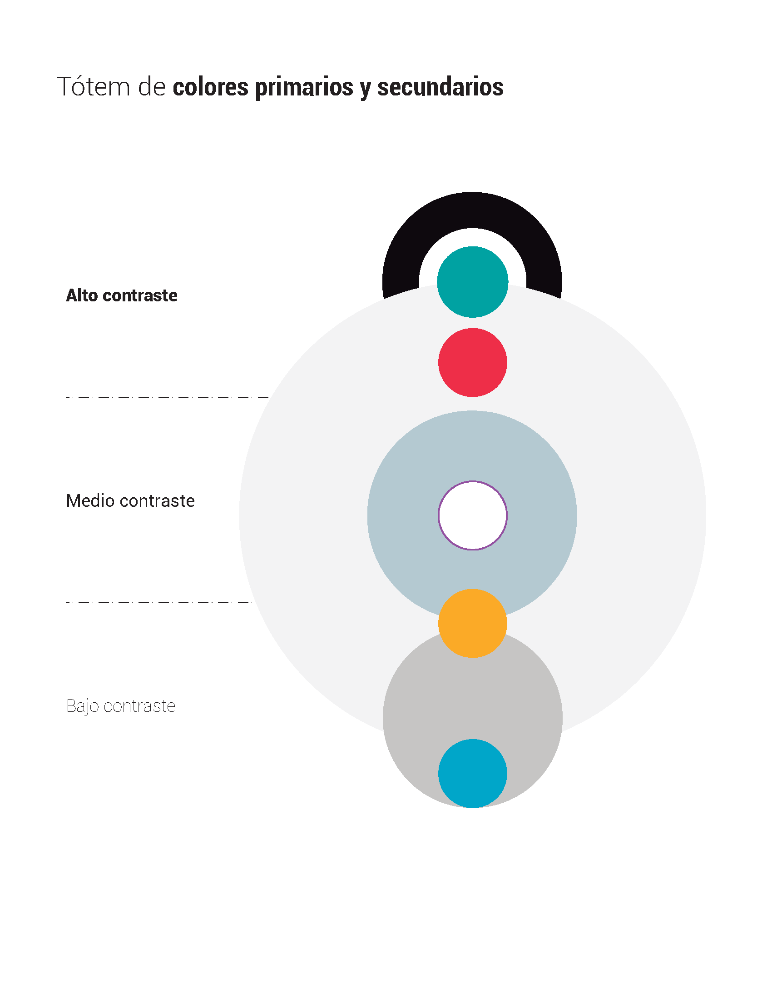
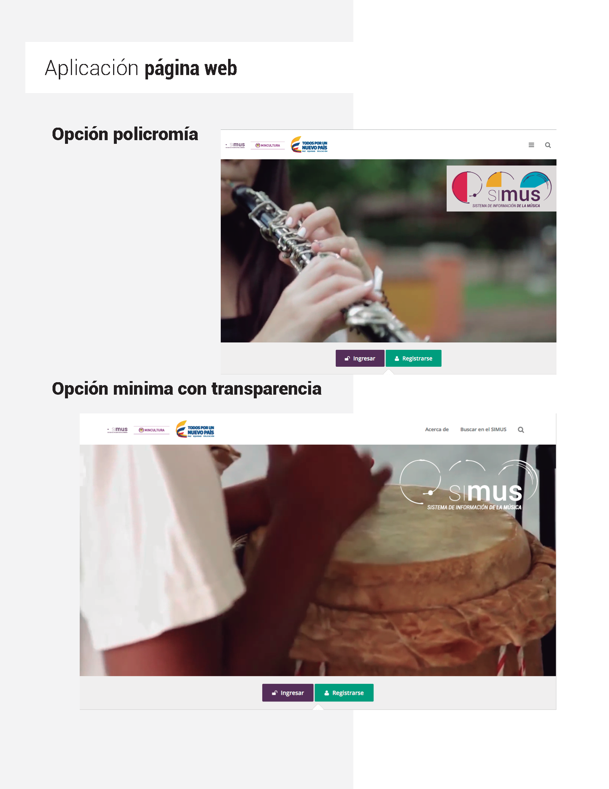

# SIMUS

📆 2019 - Sistema de información de la Música

## El encargo

Creación de logotipo, implementación y mejora de la interfaz de usuario para el _Sistema de Información de la Música_ SIMUS del el Ministerio de Cultura de Colombia.

## El desafío

Apoyar las actividades requeridas para la normalización, implementación y mejora del componente gráfico en coordinación con el Sistema Nacional de Información Cultural de Colombia (SINIC).

## La solución

A partir de los tres entornos "Estado, mercado y sociedad", se creó una paleta de colores y una geometría para el logotipo inspirada en el artículo [What Mathematics Can Learn From Classical Music](https://archive.schillerinstitute.com/fid_91-96/944_math_music.html).

